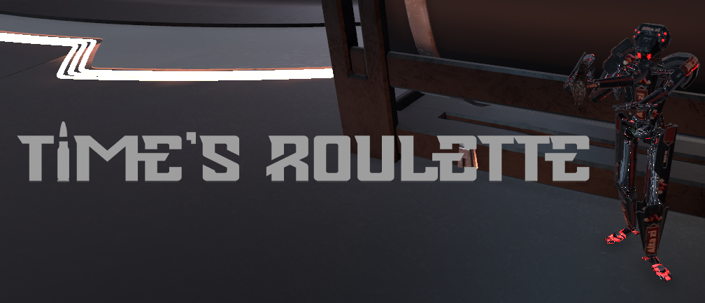

## Time's Roulette (Student Project)
 
- Homepage: https://times-roulette.school4games.net
- Itch Page: https://s4g.itch.io/times-roulette

#### Local / Online PvP FPS

Time's Roulette is a competitive First-Person-Shooter in which 
the player jumps into the role of a powerful android, competing with their
counter parts via fast movement and gunplay.
The player starts with a basic pistol but has access to 5 weapons in total,
spread throughout each map.
The first android to reach 30 confirmed assassinations wins the round.

#### Gameplay
- fast and smooth movement mechanics
- quick and precise gunplay, rewarding quick reflexes and high accuracy
- with pure focus on competitive multiplayer, no two rounds are the same

#### Roles
- Gameplay Programmer
- UI Programmer

#### Engine / Languages
- Unity, C#

#### Responsibilities
- Implemented Player Movement that is easily editable for designers via Inspector values
  - Sprinting
  - Dashing
  - Multi-Air-Jumps
  - Wall Climbing/Jumping
- Built upon a weapon system, designed by my co-engineer
  - Working hit registration
  - Implemented projectile-shots (rocket launcher)
  - Implemented Weapon Switching
- Combat Mechanics
- Round-system
- Character Selection
- Implementation of the menu-screenflow & options menu
